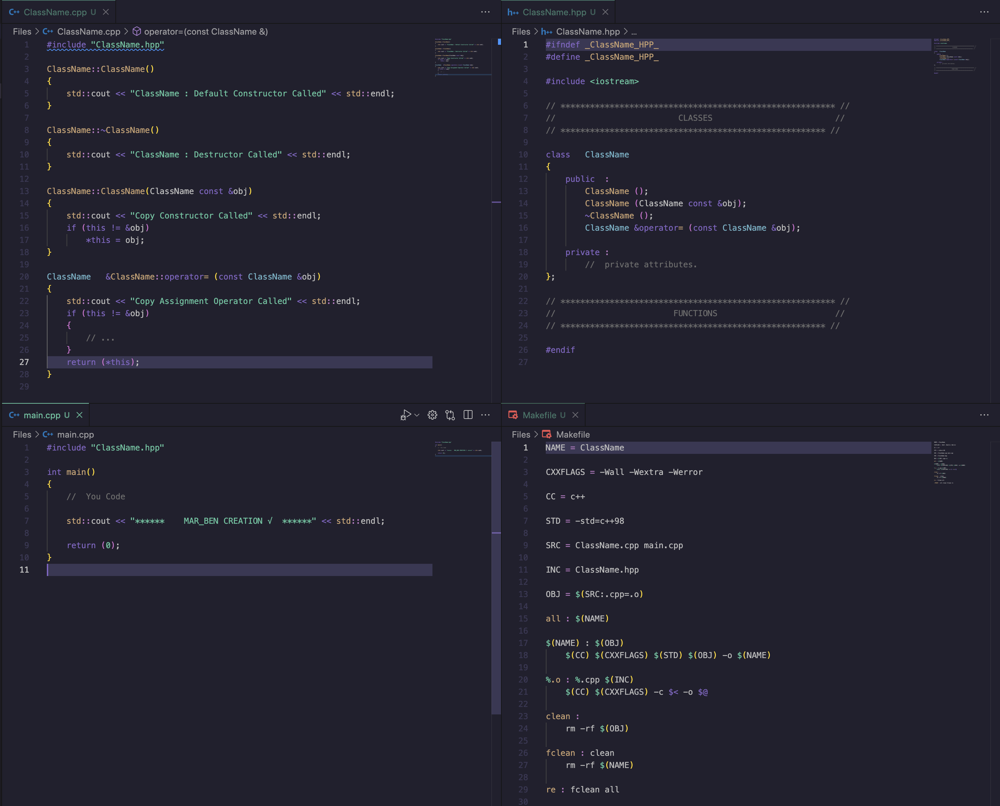
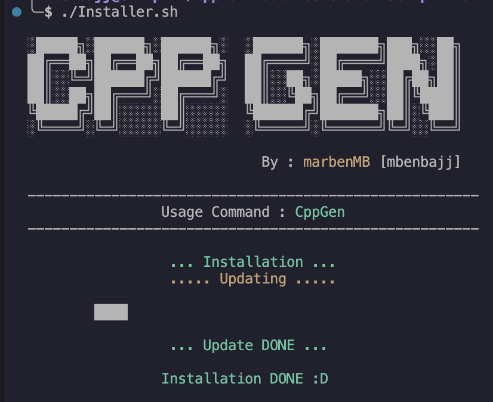
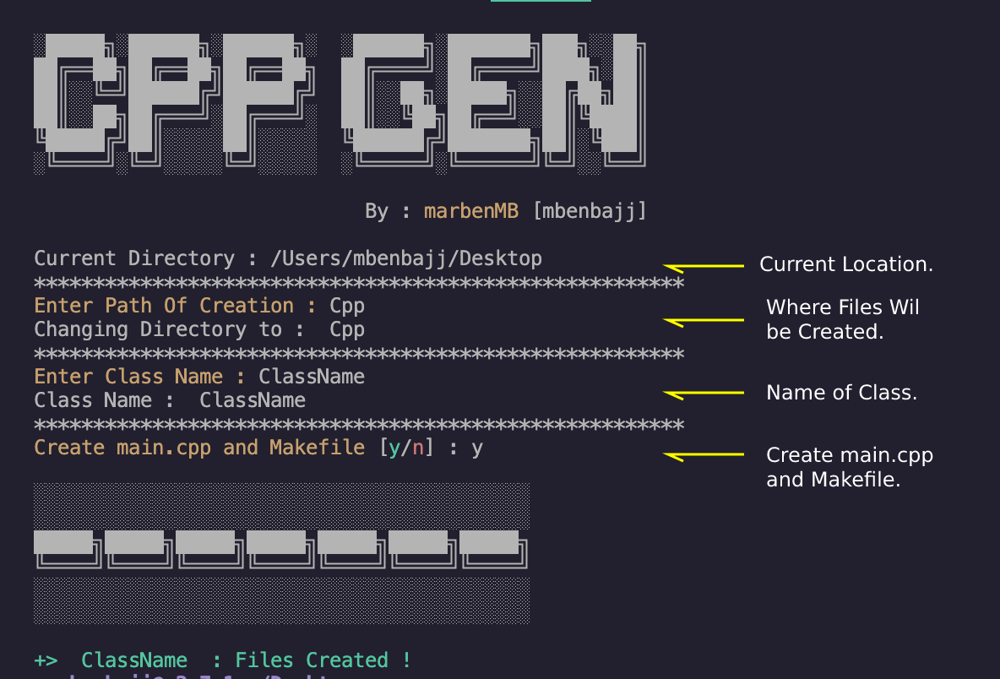
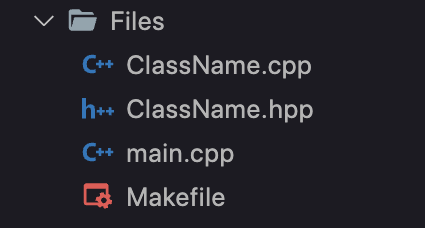
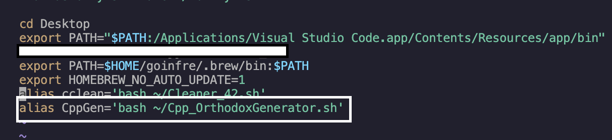

# Cpp Orthodox Generator Script

### Created by : [marbenMB](https://github.com/marbenMB)

---

## Purpose :

- This Scripts generates files (.cpp , .hpp , Makefile…) for a c++ class designed in Orthodox Canonical Form.



## Installation :

- Execute this line of command in your terminal :

```jsx
cd && git clone https://github.com/marbenMB/Cpp-Orthodox-Generator-Script.git
```

- The Script will be cloned to the Home directory :

```jsx
cd ~
```

- Get in the script directory :

```jsx
cd Cpp-Orthodox-Generator-Script
```

- Then run the Installer script :

```jsx
./Installer.sh
```



- The script will be installed Successfully.

## Usage :

- For Usage now use `CppGen` command instead of running the script every time:

```jsx
CppGen
```

- Where ever you are located the script will works using this command.



- Then You will find the files where you choose to create.




🔴 If There is some issues with script : 

- run : `vim ~/.zshrc`  and delete the line of  CppGen alias



- Then install again by running the installer script : `./Installer.sh`
